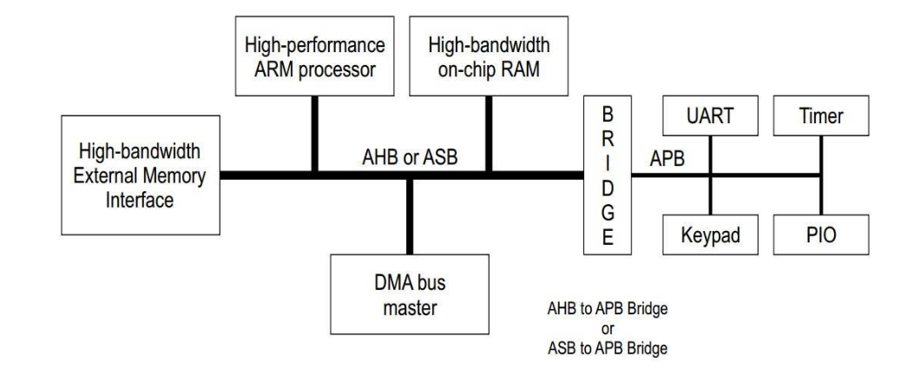
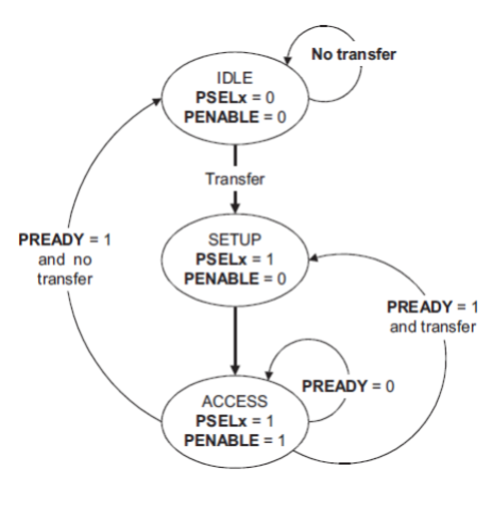
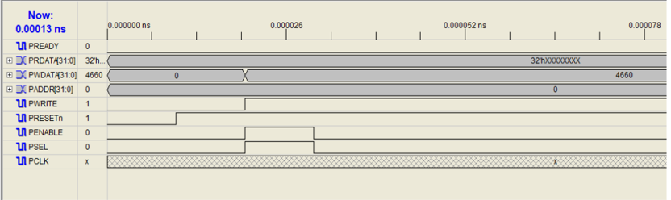
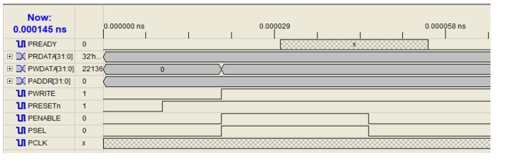
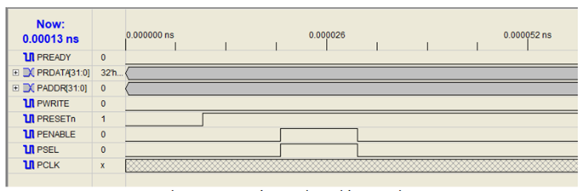
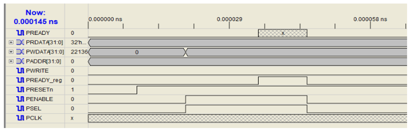

# Design and Implementation of AMBA APB Protocol using Verilog

## Table of Contents
1. [Introduction](#introduction)
2. [Abstract](#abstract)
3. [AMBA APB Protocol Features](#amba-apb-protocol-features)
4. [Design and Implementation](#design-and-implementation)
    - [State Diagram](#state-diagram)
    - [APB Read and Write Operations](#apb-read-and-write-operations)
    - [APB Interface with Slaves](#apb-interface-with-slaves)
5. [Simulation and Results](#simulation-and-results)
    - [Write Without Wait](#write-operation-without-wait)
    - [Write With Wait](#write-operation-with-wait)
    - [Read Without Wait](#read-operation-without-wait)
    - [Read With Wait](#read-operation-with-wait)
6. [Conclusion and Future Scope](#conclusion-and-future-scope)
7. [References](#references)

---

## Introduction
The Advanced Microcontroller Bus Architecture (AMBA) is a widely used on-chip communication standard for System-on-Chip (SoC) designs. The **Advanced Peripheral Bus (APB)** is an integral component optimized for low bandwidth, low-power, and cost-effective communication with peripherals such as UARTs, timers, and keypads.

This project focuses on designing and implementing the APB protocol using **Verilog HDL** while ensuring compliance and functionality through rigorous simulation and testing.

---

## Abstract
The AMBA APB protocol facilitates communication between a master and one or more slaves. This project adopts a **reuse-based design methodology** essential for scalable and cost-effective VLSI systems. The primary objectives include:
- Designing the APB protocol for SoC peripheral integration.
- Testing through specific scenarios, including write and read operations (with and without wait states).
- Verification using simulation tools such as **Xilinx ISE** to analyze and debug the design's behavior.

The results confirm the suitability of APB for low-bandwidth communication in embedded systems.

---

## AMBA APB Protocol Features
1. **Simple and Low Power**: Designed for low-frequency peripherals, reducing complexity and power consumption.
2. **Non-Pipelined Protocol**: Simplifies integration with low-bandwidth devices.
3. **Two Phases**:
   - **Idle Phase**: Default state.
   - **Setup Phase**: Signals are initialized.
   - **Access Phase**: Data transfer occurs.
5. **Scalability**: Supports multiple peripherals with unique addresses.
6. **Signal Stability**: Operates on the rising edge of a clock cycle.

---

## Design and Implementation

### State Diagram
The APB protocol operates through three states:
1. **IDLE**: Default state where no operations are performed.
2. **SETUP**: Signals are initialized to begin a transaction.
3. **ENABLE**: Data transfer occurs, followed by a return to IDLE if no further transfers are needed.

### APB Read and Write Operations
#### Write Operation
- **No Wait**: Completes in two clock cycles (IDLE → SETUP → ENABLE).
- **With Wait**: Incorporates additional clock cycles to account for slave readiness.

#### Read Operation
- **No Wait**: Similar to write, completes in two clock cycles.
- **With Wait**: Additional cycles are used until the slave signals readiness.

### APB Interface with Slaves
The APB master generates control signals (`PSEL`, `PWRITE`, etc.) to initiate communication, while the slave responds with data or status.

---

## Simulation and Results
### Tools Used
- **Xilinx ISE**: For simulation and debugging.
- **Verilog HDL**: For design and testbench creation.

### Testbenches
Four distinct test cases were simulated to validate the design:
1. **Write Without Wait**: Demonstrates a simple write operation completed in two clock cycles.
2. **Write With Wait**: Includes wait states to handle delays from the slave.
3. **Read Without Wait**: Fetches data from the slave in two clock cycles.
4. **Read With Wait**: Waits for slave readiness before completing the read operation.

### Results

### Write Operation Without Wait

### Write Operation With Wait

### Read Operation Without Wait

### Read Operation With Wait

The simulations confirmed successful data transfer, with correct address decoding and data synchronization.

---

## Conclusion and Future Scope
### Conclusion
The project successfully designed and implemented the APB protocol. Simulated waveforms validated functional correctness, confirming the protocol's reliability for low-bandwidth SoC peripheral integration.

### Future Scope
- **Performance Optimization**: Enhance throughput and latency for high-speed applications.
- **Extended Compatibility**: Support advanced peripherals such as sensors and accelerators.
- **IoT Integration**: Adapt the protocol for IoT and edge computing applications.

---

## References
1. Shankar et al., "Design and Verification of AMBA APB Protocol," *International Journal of Computer Applications*, Vol. 95, No. 21, 2014.
2. Soumya Rai et al., "Comparison between ARM AMBA Protocols and Verification of APB Protocol," *IRJET*, Vol. 8, No. 6, 2021.
3. ARM, "AMBA Specification Overview," [ARM Official Site](http://www.arm.com).
4. Samir Palnitkar, "Verilog HDL: A Guide to Digital Design and Synthesis (2nd Edition)," Pearson, 2008.

---

### Thank You
